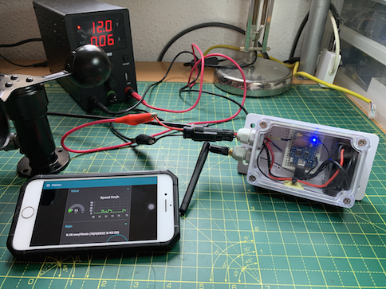
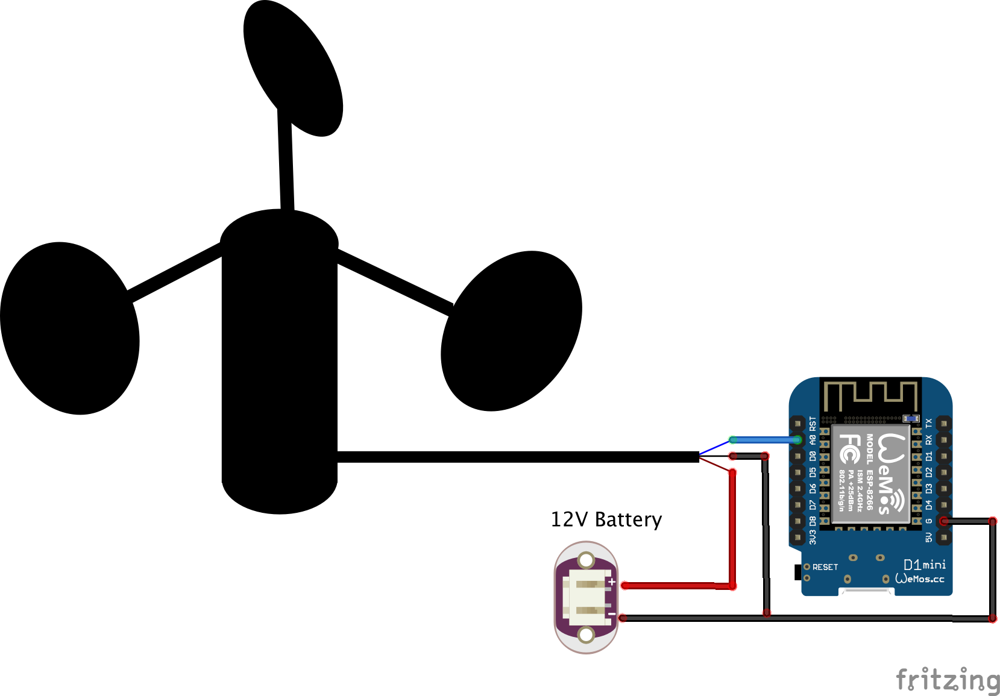
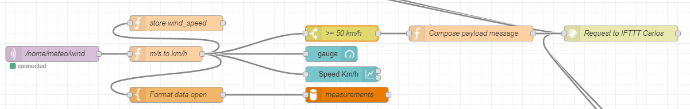
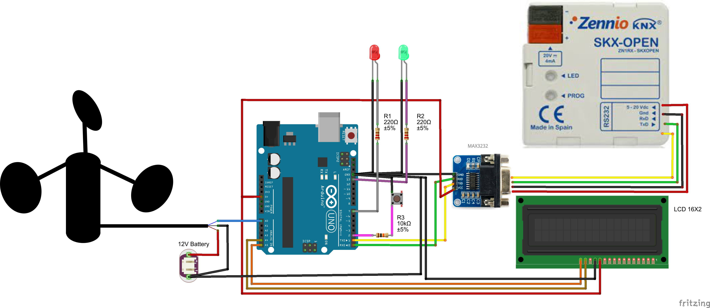
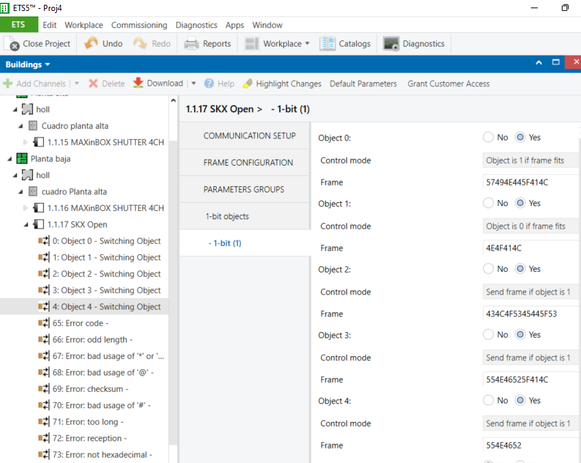
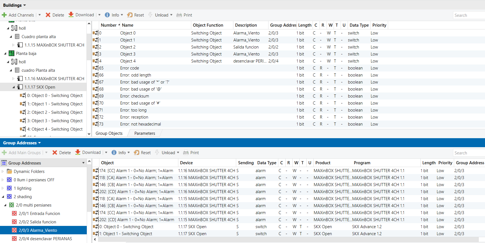

# Conectividad IoT para anemómetros
Cada día es más habitual el uso de sensores de viento integrados con la lógica domótica de los edificios. Para ello es imprescindible considerar el anemómetro como un dispositivo IoT con capacidad de conexión en los diferentes protocolos de comunicación: MQTT, KNX, y medios de transmisión como Ethernet o WiFi.

## Versión Arduino WEMOS-D1 MQTT por WiFi
Esta es la versión más simple y versátil. El sensor está conectado a un microcontrolador ESP8266 montado en una caja estanca con resistencia IP66 por lo que puede instalarse en el exterior. Además podrá utilizarse como dispositivo portátil.



### Lista de materiales
- [Anemómetro de cazoletas SKU:SEN0170](https://www.dfrobot.com/search-SEN0170.html)
- [WEMOS D1 Mini Pro 4M](https://es.aliexpress.com/item/32801063577.html)
- [Adaptador de corriente 12V a micro-USB](https://es.aliexpress.com/item/32973455778.html)
- [Caja exterior resistencia IP66 tapa transparente](https://es.aliexpress.com/item/4000200361035.html)

### Montaje
Utilizando cualquier protoboard solo se requiere conectar la masa comùn del microcontrolador y el anemómetro y la senal de tensión de salida del mismo a la entrada analógica del Wemos (ESP8266)



### Software
Partimos de que se dispone de un broker MQTT tipo Mosquitto y un Node-RED para procesar la información. El firmware utiliza la librería para WiFi (ESP8266WiFi.h) y la de MQTT (PubSubClient.h).
Como se ha utilizado un anemómetro alimentado por 12V que traduce la velocidad del viento a una tensión de salida entre los 0.17V para una velocidad de 1m/s a 5V para 30 m/s. El programa del microcontrolador hará este cálculo de manera que el mensaJe MQTT contiene unicamente la velocidad del viento.
Además el programa, cuando hay viento, enciende el led de la placa WEMOS Apagándolo cuando es igual a cero.

```cpp
#include <ESP8266WiFi.h>
#include <PubSubClient.h>
#include "settings.h"

unsigned long int temp1;

/* Configuración sensor */
unsigned int WindSpeed ;              

/* Configuración cliente WiFi */
WiFiClient espClient;

/* Configuración MQTT */
PubSubClient clientMqtt(espClient);
char msg[50];
String mqttcommand = String(14);

void setup() {
  Serial.begin(9600);

  // Inicializa el LED de la placa
  pinMode(LED_BUILTIN, OUTPUT);
  digitalWrite(LED_BUILTIN, HIGH);
  delay(500);

  /* Iniciar wifi */
  setup_wifi();
  clientMqtt.setServer(mqtt_server, mqtt_port);
  clientMqtt.setCallback(callback);
}

void setup_wifi() {
  delay(10);

  // Comienza el proceso de conexión a la red WiFi
  Serial.println();
  Serial.print("[WIFI]Conectando a ");
  Serial.println(ssid);

  // Modo estación
  WiFi.mode(WIFI_STA);
  // Inicio WiFi
  WiFi.begin(ssid, password);

  while (WiFi.status() != WL_CONNECTED) {
    delay(500);
    Serial.print(".");
  }

  Serial.println("");
  Serial.println("[WIFI]WiFi conectada");
  Serial.print("[WIFI]IP: ");
  Serial.print(WiFi.localIP());
  Serial.println("");
}

void callback(char* topic, byte* payload, unsigned int length) {
  Serial.print("[MQTT]Mensaje recibido (");
  Serial.print(topic);
  Serial.print(") ");
  mqttcommand = "";
  for (int i = 0; i < length; i++) {
    mqttcommand += (char)payload[i];
  }
  Serial.print(mqttcommand);
  Serial.println();
  // Switch on the LED if an 1 was received as first character
  if (mqttcommand == "comando") {
    Serial.println("comando");
  }  
}

void reconnect() {
  Serial.print("[MQTT]Intentando conectar a servidor MQTT... ");
  // Bucle hasta conseguir conexión
  while (!clientMqtt.connected()) {
    Serial.print(".");
    // Intento de conexión
    if (clientMqtt.connect(mqtt_id)) { // Ojo, para más de un dispositivo cambiar el nombre para evitar conflicto
      Serial.println("");
      Serial.println("[MQTT]Conectado al servidor MQTT");
      // Once connected, publish an announcement...
      clientMqtt.publish(mqtt_sub_topic_healthcheck, "starting");
      // ... and subscribe
      clientMqtt.subscribe(mqtt_sub_topic_operation);
    } else {
      Serial.print("[MQTT]Error, rc=");
      Serial.print(clientMqtt.state());
      Serial.println("[MQTT]Intentando conexión en 5 segundos");

      delay(5000);
    }
  }
}

void loop() {
  if (!clientMqtt.connected()) {
    reconnect();
  }
  clientMqtt.loop();
    
  if (millis()-temp1>update_time_sensors) {
    temp1=millis();
    
    // Lectura del puerto analógico y traducción del voltaje a velocidad  
    WindSpeed = 6 * analogRead(A0) * (5.0 / 1023.0);

    Serial.print("Velocidad del viento: ");
    Serial.print(WindSpeed);
    Serial.println(" m/s");
      
    // Envía la lectura por MQTT
    snprintf (msg, 10, "%6i", WindSpeed);
    Serial.print("[MQTT] Sending data: ");
    Serial.println(msg);
    clientMqtt.publish(mqtt_pub_topic_voltage, msg);   
    delay (1000);
    if (WindSpeed==0) {
      digitalWrite(LED_BUILTIN, HIGH);       
    } else {
      digitalWrite(LED_BUILTIN, LOW);
    }
  }
}
```
Los parámetros de conexión y tiempos, están definidos en un setting.h:

```cpp
// WiFi Configuration
const char* ssid = "MiFibra-2D79-terraza";
const char* password = "";

// MQTT Configuration
const char* mqtt_server = "192.168.1.114";
const int mqtt_port = 1883;
const char* mqtt_id = "anemometer_cups";
const char* mqtt_sub_topic_healthcheck = "/home/meteo/anemometer/healthcheck";
const char* mqtt_pub_topic_voltage = "/home/meteo/anemometer/wind_speed";
const char* mqtt_sub_topic_operation = "/home/meteo/anemometer/operation";

// Other params
const int update_time_sensors = 59000;
```

### Back-end
El procesado y almacenamiento de la información se orquesta desde una aplicación Node-RED. El _flow_ está subscrito al _topic_ de velocidad de viento "/home/meteo/anemometer/wind_speed". A partir del mensaje con la velocidad de viento en m/s, se hace el cálculo a km/h para almacenar el dato en una BBDD MySQL, presentar la información en un _dashboard_ y validar el umbral de alerta para enviar un mensaje por el servicio IFTTT. El código .json del flujo está en: https://github.com/McOrts/Anemometro_IoT_MQTT_KNX/blob/main/code/node-red_flow.json




## Versión RaspberryPi MQTT por Ethernet
También se puede implementar un sensor de viento sobre una _single board computer_ como la Raspberry Pi y utilizando señal de pulsos como la que tiene anemómetros como el [WH-SP-WS01](https://es.aliexpress.com/item/1005001484228267.html)


### Sofware
En este caso he empleado un programa Python que además de enviar el mensaje MQTT, almacena la lectura en una BBDD MySQL y notifica por mail si la velocidad del viento excede de un umbral. Este y otro parámetros están configurados externamente en el fichero config.json.

```python
#!/usr/bin/python
# -*- coding: utf-8 -*-

import RPi.GPIO as GPIO
import smtplib
import datetime
import time
import MySQLdb as mdb
import logging
import os
import fnmatch
import math
import json
from pprint import pprint
import sys
import paho.mqtt.client as mqtt

# To avoid the error on rc.local execution envirotment: 
#WARNING urllib3.connectionpool Retrying (Retry(total=2, connect=None, read=None, redirect=None, status=None)) after connection broken by 'NewConnectionError('<urllib3.connection
logging.getLogger("urllib3").setLevel(logging.ERROR)

# Then the code sets up the logging module. We are going to use the basicConfig() function to set up the default handler 
# so that any debug messages are written to the file /home/pi/event_error.log.
logging.basicConfig(filename='/home/pi/wind_event_error.log',
  level=logging.DEBUG,
  format='%(asctime)s %(levelname)s %(name)s %(message)s')
logger=logging.getLogger(__name__)

# Read the configuration file
DEFAULT_CONFIG_PATH = '/home/pi/config.json'
with open(DEFAULT_CONFIG_PATH, 'r') as config_file:
  config = json.load(config_file)

# anemometer parameters
count = 0
radius = 9.0
comp_factor = 2.3
interval = 60
speed = 0

# Function for storing readings into MySQL
def insertDB(speed):
  try:
    con = mdb.connect(config['db_server_ip'],
                      config['db_update_user'],
                      config['db_update_password'],
                      'measurements');
    cursor = con.cursor()
    sql = "INSERT INTO wind(speed) VALUES ('%s')" % (speed)
    cursor.execute(sql)
    sql = []
    con.commit()
    con.close()
  except mdb.Error as e:
    logger.error(e)

# Function for send an email notifing the speed reach the maximum 
def send_email_wind_speed(speed):
    # Specifying the from and to addresses
    toaddr = config['mail']['toaddr']
    cc = config['mail']['cc']
    fromaddr = config['mail']['fromaddr']
    message_subject = "[WIND] Home wind speed alert"
    message_text = "The wind speed is (Km/h): %s" % speed
    message = "From: %s\r\n" % fromaddr + "To: %s\r\n" % toaddr + "Subject: %s\r\n" % message_subject + "\r\n"  + message_text
    toaddrs = [toaddr] 
    username = '¿?@gmail.com'
    password = '¿?'
    # Sending the mail  
    try:
      server = smtplib.SMTP_SSL("smtp.gmail.com", 465)
      server.ehlo()
      server.login(config['mail']['username'],config['mail']['password'])
      # ssl server doesn't support or need tls, so don't call server.starttls() 
      server.sendmail(fromaddr, toaddrs, message)
      server.close()
    except:
      print ("failed to send mail")

# Function for calculate wind speed
def calculate_speed(r_cm, factor, time_sec):
    global count
    circ_cm = (2 * math.pi) * r_cm
    rot = count / 2.0
    dist_km = (circ_cm * rot) / 100000.0 # convert to kilometres
    km_per_sec = dist_km / time_sec
    km_per_hour = km_per_sec * 3600 # convert to distance per hour
    km_per_hour = km_per_hour * factor
    km_per_hour = round(km_per_hour,2)
    return km_per_hour

def spin(channel):
    global count
    count += 1

# Function for publish MQTT messages
def publish_MQTT_messages (p_event):
  try:
    client = mqtt.Client()
    # compose the message 
    topic = config['domohome_wind']['topic']
    payload = '{:3.2f}'.format(p_event / 1.)
    client.connect(config['MQTT']['broker_server_ip'],1883,60)
    client.publish (topic, payload)

    client.disconnect();
  except Exception as e:
    print ("exception")
    logger.error("Exception MQTT sending message: %s\n"+" "+e.__str__())

GPIO.setmode(GPIO.BCM)
GPIO.setup(config['domohome_wind']['gpio_pin'], GPIO.IN, GPIO.PUD_UP)
GPIO.add_event_detect(config['domohome_wind']['gpio_pin'], GPIO.FALLING, callback=spin)

while True:
    count = 0
    time.sleep(interval)
    speed = calculate_speed(radius, comp_factor, interval)
#    insertDB (speed)
    publish_MQTT_messages(speed)
    if speed > config['domohome_wind']['max_warning']:
        send_email_wind_speed(speed) 
```

## Versión Arduino UNO KNX
Otra opción más compleja es la integrar el sensor de viento en un bus KNX. Para asegurar la compatibilidad he usado un Arduino Uno original. El modo de lectura del anemómetro es idéntico al utilizado en el WEMOS D1. Pero la transmisión del mensaje se hace a través de comandos enviados por el puerto serie del Arduino.
A su vez necesitamos traducir estas señales a modo TTL y formato RS323 que es la manera en la que podremos insertar el mensaje en el bus KNX utilizando el gateway SKX-Open de Zennio. 



### Hardware
Para este montaje, además del anemómetro de referencia utilizado [SKU:SEN0170](https://www.dfrobot.com/search-SEN0170.html), y un Arduino Uno. Para poder llevar el mensaje al bus NKX necesitamos dos componentes:
- [Módulo convertidor de puerto serie MAX3232 RS232 a TTL](https://es.aliexpress.com/item/32982290904.html)
- [Interface Bus KNX a RS232](https://www.zennio.com/products/interfaces/skx-open)

### Sofware
En este caso tenemos un sketch de arduino con una lógica más compleja para construir un diálogo a fin de interactuar con los otros elementos de la red KNX como persianas y botoneras.

```cpp
/* Diálogo:
Estado incial: leds apagados y no lee el sensor.
Cuando se pulsa el botón  
(1) Se empieza a leer el sensor cada 2 segundos
  * Si el valor < 800
    * Se envia "NOAL"
  * si el valor >=4 m/s
    * Se envía "WIND_AL" 
    * Se conmuta el LED del verde al rojo
    * Deja de leer el sensor
    * Se espera a recibir un "CLOSED_S" que indica que la persiana está cerrada
    * Se apaga el led rojo
    * Se espera a recibir un "UNFROZEN_AL" indica desbloqueo del usuario desde la botonera KNX
    * Se espera un segundo y
       * Se envia un "UNFR"
       * Se reestablece el estado al punto (1)
*/
#include <Wire.h> 
#include <LiquidCrystal_I2C.h>

#define sensor A0 
#define boton 2 
#define ledrojo 7
#define ledverde 12

const int sensorvalue = 4;

bool leyendo;
unsigned long int temps1;
String incomingString;

//Creamos el objeto lcd con la dirección 0x3F, 16 columnas y 2 filas
LiquidCrystal_I2C lcd(0x3F,16,2);  

void setup() {
  Serial.begin(9600);
  pinMode (sensor, INPUT);
  pinMode (boton, INPUT);
  pinMode (ledrojo, OUTPUT);
  pinMode (ledverde, OUTPUT);
  temps1=millis();
  leyendo = false;
  // Inicializamos la pantalla LCD
  lcd.init();
  lcd.backlight();
  lcd.setCursor(0, 0);
  lcd.print("<-");
  lcd.setCursor(0, 1);
  lcd.print("->          m/s");
}

void analizar_sensor(){
  if (millis()-temps1>2000) {
    float outvoltage = analogRead(sensor) * (5.0 / 1023.0);
    int Level = 6*outvoltage;
    lcd.setCursor(13, 0);
    lcd.print(Level);
    if (Level<sensorvalue) {
      Serial.println("NOAL");
      lcd.setCursor(3, 0);
      lcd.print("NOAL    ");
      temps1=millis();
    } else {
      Serial.println("WIND_AL");
      lcd.setCursor(3, 0);
      lcd.print("WIND_AL ");
      digitalWrite(ledverde, LOW);
      digitalWrite(ledrojo, HIGH);
      leyendo = false;
    }
  }
}

void lee_serial(){
  while(Serial.available()) {
//  if (Serial.read()!=-1) {
      incomingString = Serial.readStringUntil('\n');// read the incoming data as string
      if (incomingString=="CLOSED_S") {
        lcd.setCursor(3, 1);
        lcd.print("CLOSED_S ");
        digitalWrite(ledrojo, LOW);
      } else if (incomingString=="UNFR_AL") {
        lcd.setCursor(3, 1);
        lcd.print("UNFR_AL  ");
        delay (1000);
        Serial.println("UNFR");
        lcd.setCursor(3, 0);
        lcd.print("UNFR      ");
        leyendo = true;        
        digitalWrite(ledverde, HIGH);
      }
  }
}

void loop() {
  if (digitalRead(boton)==HIGH) {
    delay (250);
    leyendo = true;
    digitalWrite(ledverde, HIGH);
    digitalWrite(ledrojo, LOW);
  }
  if (leyendo) {
    analizar_sensor();
  }
   
  lee_serial();
}
```

De la parte de KNX, necesitaremos configurar el SKX-Open. En primer lugar, parametrizando el gateway con objetos de 1 bit que mmanejan las tramas que genera y escucha Arduino. En esta configuración las tramas se traducen a sus valores ASCII hexadecimales.



Finalmente queda construir los grupos y asignar los objetos anteriores en función de lo que queramos hacer con los eventos. En este caso cerrar persianas y desenclavar sis objetos de alarma.



## Agradecimientos
Joaquin González Torres. Compañero Técnico de Telecomunicaciones
Joan Carbonell. Profesor del IES Politecnic
