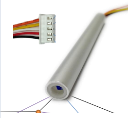
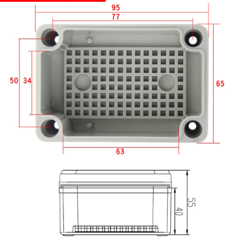
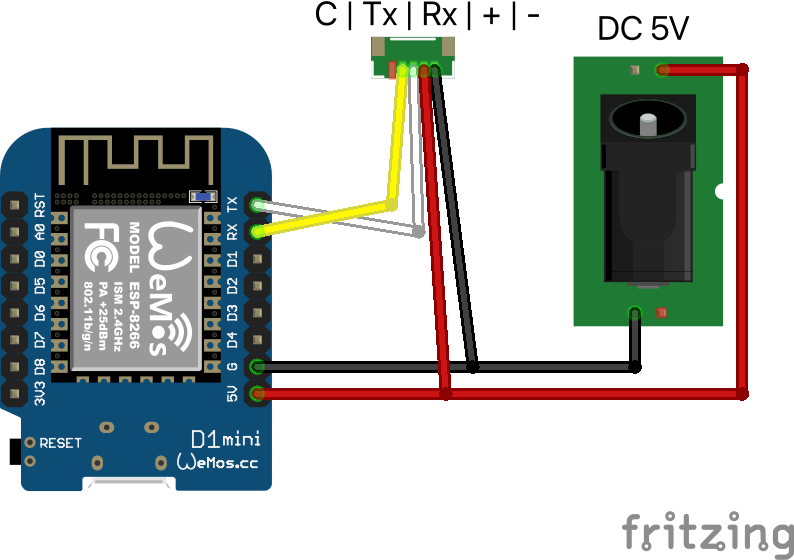
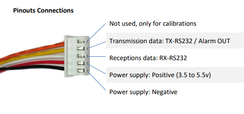
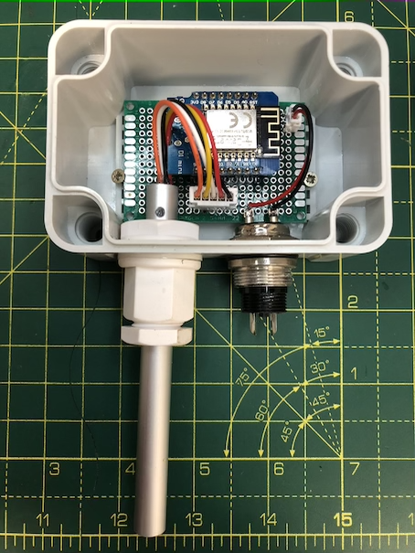

# 🌬️Anemómetro IoT de estado sólido 💨

Cada día es más habitual el uso de sensores de viento integrados con la lógica domótica de los edificios. Para ello es imprescindible considerar el anemómetro como un dispositivo IoT con capacidad de conexión en los diferentes protocolos de comunicación: MQTT, KNX, y LoRaWAN medios de transmisión de modulación inalámbrica como LoRA e WiFi o cableada con Ethernet con TCP/IP.


## Sin piezas móviles
Existe una versión simple y versátil de anemómetro que puede exponerse en el exterior pudiendo resistir condiciones metereológicas muy adversas. Partimos del sensor de viento modelo SA01 que tiene conectividad serie. El sensor está conectado a un microcontrolador ESP8266 montado en una caja estanca con resistencia IP67 por lo que puede instalarse en el exterior. La alimentación puede hacerse a través de un adaptador de 5V con conector microUSB o con batería directamente conectada a los pines GRN y 5V convirtiéndolo en un dispositivo portátil.

Debido al tipo de tecnología que utiliza este dispositivo. También tendremos una medición de la temperatura ambiental. 

### Lista de materiales
- [Anemómetro estado sólido SA01 de ECDSL](https://www.ecdsl.com/winqx.html)
- [Adaptador caja para SA01 de ECDSL](https://www.ecdsl.com/winqx.html)
- [WEMOS D1 Mini Pro 4M](https://es.aliexpress.com/item/32801063577.html)
- [Caja exterior resistencia IP67 de 95x65x55mm](https://es.aliexpress.com/item/4000287507400.html)

| Anemómetro SA01 | Adaptador SA01 | WEMOS D1 Mini PRO| Caja |
|-----------|-----------|-----------|-----------|
|  |  |   |  |



### Montaje
Utilizando cualquier protoboard solo se requiere conectar la masa comùn del microcontrolador, patilla G tanto a la alimentación como al anemómetro. De igual manera conectaremos la entrada de alimentación de 5V al anemóetro y a la primera patilla, la de 5V del microcontrolador. Recibiremos las lecturas por el puerto de transmisión/recepción serie en las respectivas patillas RX y RT del mismo lado del controlador.


Teniendo en cuenta las salidas del anemómetro SA01:
<br>
<br>
<br>
<br>
<br>
<br>

Podremos cablear una protoboard como en este ejemplo (los colores coinciden con el esquemático):


Vistas del montaje final. No se incluye la fuente de alimentación de 5V y los conectores para proporcionar esta alimentación a la caja:

| Disposición superior | Montaje en caja | Conectado |
|-----------|-----------|-----------|
||||

### Software
Partimos de que se dispone de un **broker MQTT** tipo Mosquitto y un Node-RED para procesar la información. El firmware utiliza la librería para WiFi (ESP8266WiFi.h) y la de MQTT (PubSubClient.h).

En primer lugar la aplicación intentará que el WEMOS D1 se conecte a una red Wifi y después al bloker MQTT. Si todo ha sido correcto. Publicará un "staring" en el topic de 'operation', codigo postal grabado en el topic 'cp' y su IP en la red a través del topic 'ip'.

**Las lecturas del viento se leen por el puerto serie cada 15sg**. Pero no se transmiten hasta finalizado el periodo en milisegundos configurado en el fichero setting.h con el parámetro update_time_sensors. Durante este tiempo se calculará el valor medio que será enviado como velocidad del viento y se registrán el máximo y el mínimo.

Además el programa, cuando hay viento, encienderá el led de la placa WEMOS Apagándolo cuando es igual a cero.


Con este ejemplo, el dispositivo va a publicar la siguiente información en los correspondientes topics:
* Velocidad del viento (mqtt_pub_topic_windspeed)
* Velocidad máxima, dentro de los 15 sg de muestreo (mqtt_pub_topic_windspeedpeak)
* Velocidad mínimna, dentro de los 15 sg de muestreo (mqtt_pub_topic_windspeedmin)
* Temperatura (mqtt_pub_topic_windtemperature)

Adicionalmente se van a publicar
* Mensaje de estado: "starting" cuando el microcontrolador arranque y "Frame error" en el caso de que la trama del SA01 no se interprete correctamente (mqtt_sub_topic_healthcheck)
* "/promenade_espmi/meteo/wind/healthcheck";
* IP de red asignada por el servidor SMTO (mqtt_sub_topic_ip)
* Cópigo postal grabado en el fichero settings.h (mqtt_sub_topic_cp)

Y también se subscribirá a este topic:
* Mesajes de control para acciones o cambiar configuración (mqtt_sub_topic_operation)

Todos estos parámetros están registrados como constantes en el fichero settings.h:
```cpp
// WiFi Configuration
const char* ssid = "";
const char* password = "";

// MQTT Configuration
const char* mqtt_server = "";
const int   mqtt_port = 1188;
const char* mqttUser = "";
const char* mqttPassword = "";
const char* mqtt_id = "anemometer_solid_1";
const char* mqtt_sub_topic_healthcheck = "/promenade_espmi/meteo/wind/healthcheck";
const char* mqtt_sub_topic_operation = "/promenade_espmi/meteo/wind/operation";
const char* mqtt_sub_topic_ip = "/promenade_espmi/meteo/wind/ip";
const char* mqtt_sub_topic_cp = "/promenade_espmi/meteo/wind/cp";

const char* mqtt_pub_topic_windspeed = "/promenade_espmi/meteo/wind/speed";
const char* mqtt_pub_topic_windspeedpeak = "/promenade_espmi/meteo/wind/speed_peak";
const char* mqtt_pub_topic_windspeedmin = "/promenade_espmi/meteo/windspeed_min";
const char* mqtt_pub_topic_windtemperature = "/promenade_espmi/meteo/wind/temperature";

// Other params
const int update_time_sensors = 59000;
```


### Back-end
El procesado y almacenamiento de la información se orquesta desde una aplicación Node-RED. El _flow_ está subscrito a los _topics_ como el de velocidad de viento "/home/meteo/anemometer/wind_speed". Estos valores se grafican usando nodos de 'dashboard ui' y se persisten en una BBDD PostgreSQL.


En el ejemplo también se ha utilizado un anemómetro tradicional a efectos de hacer una comparativa entre sus mediciones. Ambos dispositivos se leen a través de mensajes MQTT.


El código .json de este flujo está en: 
https://github.com/McOrts/Anemometro_IoT_MQTT_KNX/blob/main/anemometro_arduino_wifi_mqtt_SolidState/src/Node-RED_Flow.json


## Agradecimientos
- **Adrian Bracolino**. Creador del dispositivo SA01.
- **Associación de vecinos del Paseig Maritim**. Por permitirnos instalar un protitipo en la terraza de uno de los edificios más altos de la zona
